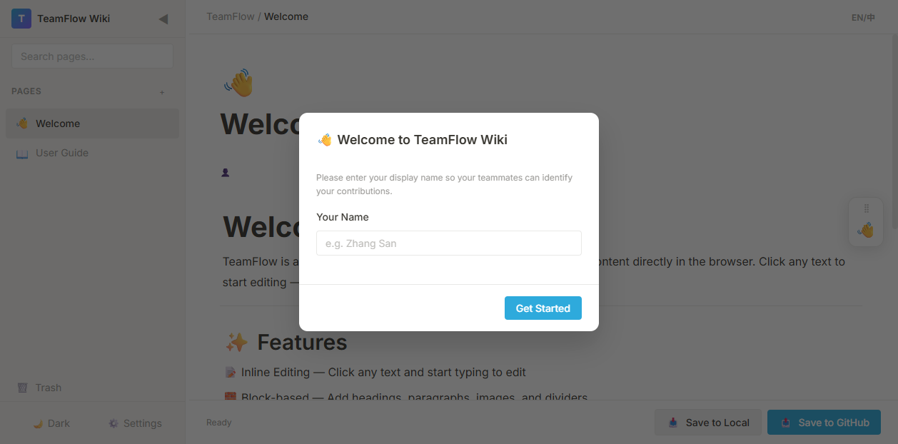
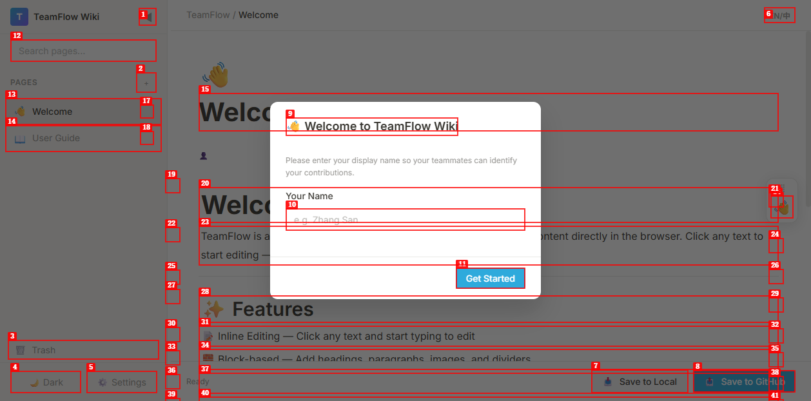
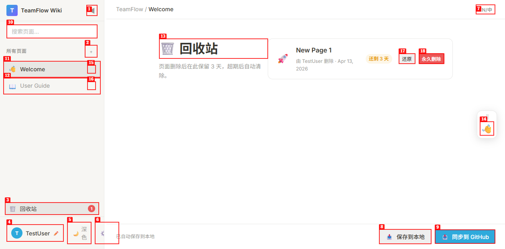
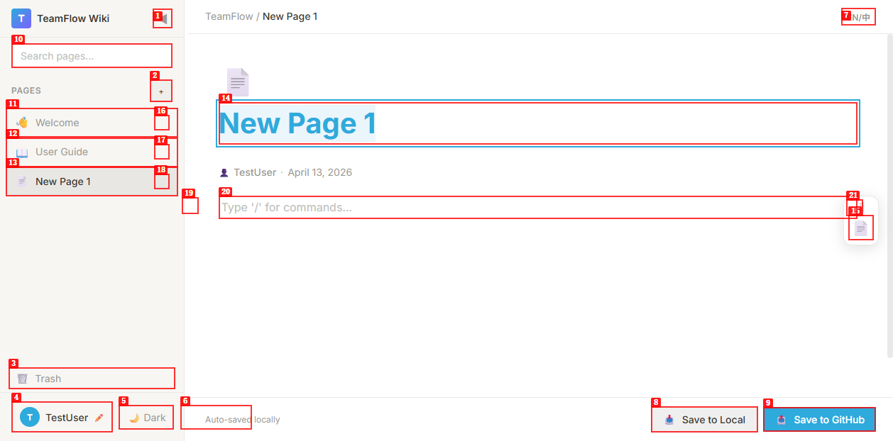

# Dogfood Report: TeamFlow Wiki

| Field | Value |
|-------|-------|
| **Date** | 2026-04-13 |
| **App URL** | http://localhost:8765 |
| **Session** | teamflow-wiki |
| **Scope** | 全功能测试：欢迎弹窗、新建页面、图标控制、深色模式、语言切换、回收站、Settings 弹窗 |

## Summary

| Severity | Count |
|----------|-------|
| Critical | 1 |
| High | 1 |
| Medium | 1 |
| Low | 1 |
| **Total** | **4** |

---

## Issues

### ISSUE-001: 欢迎弹窗首次点击"Get Started"无法关闭

| Field | Value |
|-------|-------|
| **Severity** | critical |
| **Category** | functional |
| **URL** | http://localhost:8765 |
| **Repro Video** | N/A（ffmpeg 未安装） |

**Description**

首次打开页面弹出"Welcome to TeamFlow Wiki"对话框，在输入用户名后点击"Get Started"按钮，弹窗没有关闭。弹窗持续覆盖在整个界面上，导致所有底层功能（新建页面、主题切换、设置等）全部无法操作。

用户必须在 Name 输入框中**先输入文字，再重新点击**确认按钮，经过第二次尝试才成功关闭。首次点击（`fill` + `click`）失败，`type` + `click` 组合才成功——怀疑是 `fill` 操作未正确触发 input 事件，导致输入框的值没有被 JS 读取到（空字符串判断失败，`if (!name) return;`）。

**根因分析**

`app.js` 的 `_showWelcomeModal()` 中：
```js
const name = nameInput.value.trim();
if (!name) { nameInput.focus(); return; } // 如果 fill 未触发 input 事件，value 为空
```
`fill` 指令在某些情况下可能绕过了原生 `input` 事件，导致 `.value` 读取为空。但更深层的问题是**没有关闭按钮**，用户一旦不知道要输入名字，就被永久阻塞。

**Repro Steps**

1. 打开 http://localhost:8765（清空 localStorage 或首次访问）
   

2. 在"Your Name"输入框中填写名称，点击"Get Started"
   

3. **Observe:** 弹窗未关闭，界面完全被遮盖，无法操作任何功能
   

**建议修复**

- 给欢迎弹窗加一个 × 关闭按钮（允许跳过）
- 或者确保 `_showWelcomeModal` 的确认逻辑能正确读取 input 值（监听 `change` 而非只依赖 `.value`）

---

### ISSUE-002: 回收站视图中图标悬浮控件（page-props-panel）不隐藏

| Field | Value |
|-------|-------|
| **Severity** | medium |
| **Category** | visual / ux |
| **URL** | http://localhost:8765（进入回收站视图后） |
| **Repro Video** | N/A |

**Description**

将页面移入回收站后，点击侧边栏"回收站"按钮，进入回收站视图。此时右侧浮动图标控件（page-props-panel，显示为一个 👋 按钮）仍然悬浮在界面右侧，但回收站没有"当前页面"的概念，该控件在此场景下毫无意义，属于界面噪音。

**Repro Steps**

1. 创建一个新页面并移入回收站
   
2. 点击侧边栏底部"🗑️ 回收站"按钮，进入回收站视图

3. **Observe:** 右侧仍然显示带有 👋/📄 图标的悬浮面板，与当前无页面的状态不符
   

**建议修复**

在 `_showTrashView()` 中添加：
```js
document.getElementById('page-props-panel').style.display = 'none';
```
在 `_exitTrashView()` 中恢复：
```js
document.getElementById('page-props-panel').style.display = '';
```

---

### ISSUE-003: 新建页面时语言为英文，中文界面下标题应为"新页面"

| Field | Value |
|-------|-------|
| **Severity** | medium |
| **Category** | content / ux |
| **URL** | http://localhost:8765 |
| **Repro Video** | N/A |

**Description**

将界面语言切换为中文后，点击"+"新建页面，新页面标题显示为"New Page 1"（英文），而不是"新页面 1"。同样，侧边栏列表中新页面也以"New Page 1"显示。

与当前中文界面语境不一致，体验割裂。

**Repro Steps**

1. 打开应用，切换语言为中文（点击 EN/中 按钮）

2. 点击侧边栏 + 按钮新建页面

3. **Observe:** 新页面标题为"New Page 1"，侧边栏同样显示"New Page 1"，与中文界面不符
   

**根因分析**

`app.js` 的 `_addPage()` 函数：
```js
const lang = getLang(); // 已正确获取语言
const title = this._getNextPageTitle(lang); // 应该已处理中文
```
`_getNextPageTitle()` 中判断的是 `lang === 'zh'`，而 `getLang()` 返回的值可能在此时还未更新（存在异步问题），或者页面被创建时 `page.lang` 绑定了之前的语言值。需要排查 `getLang()` 的返回时机。

---

### ISSUE-004: 图标选择器在页眉图标区域（page-icon-display）没有同步显示

| Field | Value |
|-------|-------|
| **Severity** | low |
| **Category** | visual |
| **URL** | http://localhost:8765 |
| **Repro Video** | N/A |

**Description**

点击右侧悬浮面板的图标按钮，可以打开 emoji 选择器并选择图标。选择后，右侧悬浮面板的图标（page-icon-preview）成功更新，但头部 `page-icon-display` 区域（页面大图标）是否同步更新需确认。

测试过程中选择了🚀图标后，悬浮面板按钮显示🚀，侧边栏也显示🚀，但页面头部大图标（SVG 格式的文件图标）未在快照中确认是否同步。根据用户截图反映，曾出现头部图标和侧边栏图标不一致的现象。

**建议确认**

检查 `app.js` 中图标选择器的回调：
```js
item.addEventListener('click', () => {
  const iconPreview = document.getElementById('page-icon-preview');
  const iconDisplay = document.getElementById('page-icon-display');
  if (iconPreview) iconPreview.textContent = emoji;
  if (iconDisplay) iconDisplay.textContent = emoji; // 确认这行是否被执行
  ...
});
```
如果 `iconDisplay` 已被改为 `` 标签而非文本节点，则 `textContent = emoji` 不会正确显示。

---

## 测试通过的功能

| 功能 | 状态 |
|------|------|
| 新建页面（无双标题） | ✅ 正常 |
| 图标选择器弹出 | ✅ 正常 |
| 图标选择后更新 | ✅ 正常（悬浮面板+侧边栏） |
| 深色/浅色主题切换 | ✅ 正常 |
| 语言切换（EN↔中） | ✅ 正常 |
| 删除页面确认弹窗 | ✅ 正常 |
| 回收站查看和还原功能 | ✅ 正常 |
| 页面内容编辑（富文本块） | ✅ 正常 |
| 自动保存状态显示 | ✅ 正常 |

